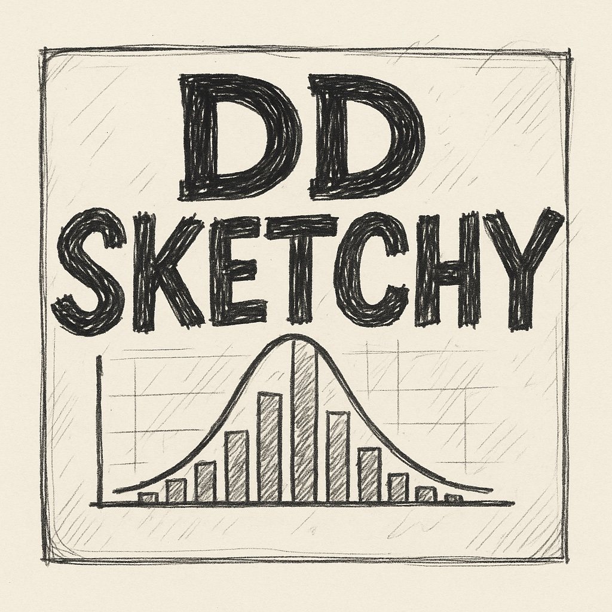

# dd-sketchy

This is a Rust implementation of the [DDSketch](https://arxiv.org/pdf/1908.10693.pdf) quantile sketch algorithm. 
DDSketch is a fully-mergeable quantile sketch with relative-error guarantees.

# dd-sketchy Features

* Implements the DDSketch algorithm with configurable relative error guarantees
* Optimized for high-throughput data collection scenarios
* Designed for distributed systems with efficient sketch merging

## Usage

```rust
use dd_sketchy::{DDSketch, DDSketchError};

fn main() -> Result<(), DDSketchError> {
    // Create a new sketch with 1% relative error
    let mut sketch = DDSketch::new(0.01)?;

    // Add some values
    sketch.add(1.0);
    sketch.add(2.0);
    sketch.add(3.0);
    sketch.add(4.0);
    sketch.add(5.0);

    // Get the 50th percentile (median)
    let median = sketch.quantile(0.5)?;
    println!("Median: {}", median);

    // Get the 90th percentile
    let p90 = sketch.quantile(0.9)?;
    println!("90th percentile: {}", p90);

    Ok(())
}
```

## Serialization Support

dd-sketchy supports optional serialization via [serde](https://serde.rs/). **Serialization is disabled by default** to keep the library dependency-free. To enable it, add the `serde` feature:

```toml
[dependencies]
dd-sketchy = { version = "0.1", features = ["serde"] }
serde_json = "1.0"  # or other serde formats
```

```rust
use dd_sketchy::DDSketch;

fn main() -> Result<(), Box<dyn std::error::Error>> {
    let mut sketch = DDSketch::new(0.01)?;
    sketch.add(1.0);
    sketch.add(2.0);

    // Serialize to JSON
    let json = serde_json::to_string(&sketch)?;
    println!("Serialized: {}", json);

    // Deserialize from JSON
    let restored: DDSketch = serde_json::from_str(&json)?;

    // Verify the sketch works correctly
    assert_eq!(sketch.count(), restored.count());
    assert_eq!(sketch.quantile(0.5)?, restored.quantile(0.5)?);

    Ok(())
}
```

The serialization handles all internal state including infinity values for min/max bounds in empty sketches. Empty sketches serialize min/max as `null` values, while sketches with data serialize them as numbers.

## Minimum Supported Rust Version (MSRV)

This crate supports Rust 1.75.0 and later. We follow a rolling MSRV policy of approximately 1 year behind the latest stable release. MSRV increases may occur in minor releases and will be noted in the changelog.

## References

* [DDSketch: A Fast and Fully-Mergeable Quantile Sketch with Relative-Error Guarantees](https://arxiv.org/pdf/1908.10693.pdf) - The original paper describing the DDSketch algorithm

## Other implementations

* https://github.com/cecton/opentelemetry-rust/blob/a0899d9ed595343e9d4eb2dbd994235dedb501ed/opentelemetry/src/sdk/metrics/aggregators/ddsketch.rs#L778-L796
* https://github.com/mheffner/rust-sketches-ddsketch
